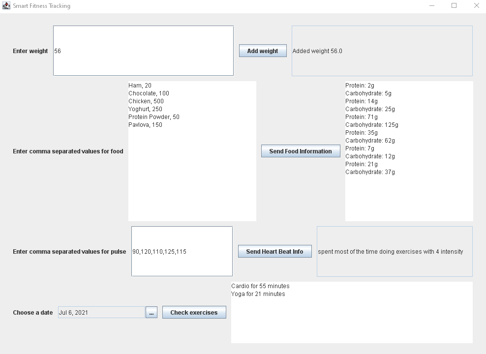

# FITNESS CLASS PROGRESS TRACKING

- [1. Introduction](#1-introduction)
- [2. Service definitions](#2-service-definitions)
  - [2.1 My Smart gym](#21-my-smart-gym)
    - [2.1.1 RPC Method 1: ConsumedFoodStreaming (via FitnessPal)](#211-rpc-method-1-consumedfoodstreaming-via-fitnesspal)
    - [2.1.2 RPC Method 2: WeightUpdate (via Smart Weights)](#212-rpc-method-2-weightupdate-via-smart-weights)
    - [2.1.3 RPC Method 3: HeartTracking (via MyZone heart tracking belt)](#213-rpc-method-3-hearttracking-via-myzone-heart-tracking-belt)
  - [2.2 Service 2: My Smart Fitness](#22-service-2-my-smart-fitness)
    - [2.2.1 RPC Method 1: ActivityTracking](#221-rpc-method-1-activitytracking)
- [3 Service implementations](#3-service-implementations)
  - [3.1 MySmartGym](#31-mysmartgym)
  - [3.2 MySmartFitness](#32-mysmartfitness)
- [4. Naming Services](#4-naming-services)
- [5. Remote error handling](#5-remote-error-handling)
- [6. Client - Graphical User Interface (GUI)](#6-client---graphical-user-interface-gui)

## 1. Introduction

This report outlines processes optimisation in a gym setting for smart, efficient and integrated monitoring system of clients progress in terms of their nutrition, step count, fitness activity, strength, endurance, heart rate during classes. The proposed system will allow to integrate numerous fitness devices the client is using as well as separate apps the gym instructors are using to track clients weight, class attendance etc.
Following the analysis of the current processes, it was established that as of now the gym instructors use: smart weights (to access clients body weight, muscle mass and store this data over time); class booking app (allows to see type and frequency of client’s fitness activity in the gym gym). Clients are using: Fitbit/Garmin/Apple watch (for step count, other types of data depends on the device), MyZone belt (to track heart rate during the workout), MyFitnessPal (for calorie intake count, nutrition analysis).
The purpose of the system is to incorporate the data coming from the above mentioned apps and devices and display the dashboard for the instructor with clients activity, nutrition, weight and muscle gain progress. The system will enable the trainer not only see all the parameters on one page, but will also allow the data be live and updated on the fly. It allows for possibility to be further developed.

## 2. Service definitions

Comparing to the proposal, services use Empty and Timestamp types provided by Google instead of manually reimplemented similar types.

### 2.1 My Smart gym

Communication between devices and app and smart gym to provide information for the trainer.

#### 2.1.1 RPC Method 1: ConsumedFoodStreaming (via FitnessPal)

Bidirectional streaming RPC method. It sends stream of food consumed during the day. Receives stream of nutrients(proteins, vitamins, fats, carbs)

```protobuf
service MySmartGym {
  rpc ConsumedFoodStreaming (stream ConsumedFoodRequest) returns (stream NutrientsReply) {}
}
// The request message containing food and quantity consumed.
message ConsumedFoodRequest {
  string food = 1;
   int32 quantity = 2;}

// The response message containing the nutrients
message NutrientsReply {
  string message = 1;
}
```

#### 2.1.2 RPC Method 2: WeightUpdate (via Smart Weights)

Unary RPC method. It sends weight as measured by Smart Weights.

```protobuf
service MySmartGym {
  // Sends weight
  rpc WeightUpdate (Weight) returns (google.protobuf.Empty) {}
}
message Weight {
  float weight = 1;
}
```

#### 2.1.3 RPC Method 3: HeartTracking (via MyZone heart tracking belt)

Bidirectional streaming RPC. MyZone heart tracking belt sends heart beat measurements stream during the class. Receives time and exercise zone.

```protobuf
service MySmartGym {
  // Sends stream of heart beat measurements
  rpc HeartTracking (stream HeartBeat) returns (stream WorkoutIntensity) {}
}
message HeartBeat {
  int32 pulse = 1;
   }
message WorkoutIntensity {
  int32 zone = 1;
  int32 hour = 2;
  int32 minutes = 3;
}
```

### 2.2 Service 2: My Smart Fitness

Communication between personal fitness device/watch/tracker and My Smart Fitness to provide fitness and activity information for the person.

#### 2.2.1 RPC Method 1: ActivityTracking

Server streaming RPC. It sends date, receives stream of activities hourly for the day, e.g. activities taken, steps made.

```protobuf
service MySmartFitness {
  // Receives date, sends steam of activities and their duration on the given date
  // Server streaming RPC
  rpc ActivityTracking(google.protobuf.Timestamp) returns (stream Activity) {}
}

message Activity {
  string activity = 1;
  int32 steps = 2;
  int32 duration = 3;
}
```

## 3 Service implementations

Services were implemented using Java 16 and grpc 1.39.

### 3.1 MySmartGym

`MySmartGym` service implementation is defined in the `MySmartGymImpl` class. It also has two subclasses for processing bidirectional streaming `ConsumedFoodObserver` and `HeartBeatToIntensityObserver`.
`ConsumedFoodObserver` class has three methods. The main method is `onNext`. It processes received information and calculates the amount of nutrients (protein and carbs).

```java
    public void onNext(final ConsumedFoodRequest request) {
      final Integer proteins =
          getProtein(request.getFood(), request.getQuantity());
      final NutrientsReply proteinReply =
          NutrientsReply.newBuilder()
              .setMessage("Protein: " + proteins.toString() + "g")
              .build();

      responseObserver.onNext(proteinReply);

      final Integer carbs = getCarbs(request.getFood(), request.getQuantity());
      final NutrientsReply carbsReply =
          NutrientsReply.newBuilder()
              .setMessage("Carbohydrate: " + carbs.toString() + "g")
              .build();

      responseObserver.onNext(carbsReply);
    }
```

`getProtein` and `getCarbs` helper methods calculate amount of carbs and protein in food. For proof of concept, they use simple formulas to calculate their quantity. In production, it can use database of products to calculate the exact amount of nutrients.
`HeartBeatToIntensityObserver` class also has three methods. The main method is `onNext` as well. It calculates the intensity of the exercise based on relaxed pulse. For the proof of concept, it assumes that the pulse for max intensity is 150.

```java
    public void onNext(final HeartBeat request) {
      final Calendar cal = Calendar.getInstance();
      cal.setTime(Date.from(Instant.now()));
      final Builder intensity = WorkoutIntensity.newBuilder()
                                    .setHour(cal.get(Calendar.HOUR))
                                    .setMinutes(cal.get(Calendar.MINUTE));
      final int pulse = request.getPulse();

      // Assuming the 100% intensity pulse is 150. use formula to calculate
      // zones: 1 - up to 50% 2 - 50-65% 3 - 65-75% 4 - 75-85% 5 - 85 and higher
      if (pulse < 75) {
        intensity.setZone(1);
      } else if (pulse < 100) {
        intensity.setZone(2);
      } else if (pulse < 120) {
        intensity.setZone(3);
      } else if (pulse < 140) {
        intensity.setZone(4);
      } else {
        intensity.setZone(5);
      }
      responseObserver.onNext(intensity.build());
```

`weightUpdate` function saves the updated weight in the list to track it.

Additionally, to simplify service discovery, `MySmartGymImpl` class has two additional methods: `getServiceName`, which returns service name for the service discovery, and `getDescription` which returns description for service discovery.

### 3.2 MySmartFitness

`MySmartFitness` contains the single RPC method `activityTracking`. For proof of concept, it returns specific exercises per day of week using `Calendar` Java class (Strength, Cardio and Running) with random duration and number of steps. It also randomly returns yoga independently of the day.
It also defines `getServiceName` and `getDescription` methods to simplify service discovery.

## 4. Naming Services

Services are registered with service discovery during the server start in a separate `GrpcServer` class.
`GrpcServer` has a static method `start` to start and register specific service on a given port. It uses service methods (`getServiceName` and `getDescription`) to  provide service registration.
During the shutdown, there is a hook to unregister the service.
`GrpcServer` registers the service with the `"_http._tcp.local."` type (which is usually used by default) and `grpc` as a subtype.

## 5. Remote error handling

There are several places where the errors might occur: service registration and discovery.
The errors for service discovery are logged but ignored, since they do not prevent the correct work of the service. Service communication errors are blocking. When the application starts, when the service is not available, the error message is show.

## 6. Client - Graphical User Interface (GUI)

Client implemented in the `Controller` class. It has two separate subclasses to handle the requests to two different services: `SmartGymActionListener` and `FitnessActionListener`. They implement `ActionListener` interface.
The GUI creation is split between submethods for calling each RPC method. Several components are used for different calls: `JTextField` is used for entering single line data and showing single line response, `JTextArea` is used for entering multi-line data and showing multiline response, `JDatePicker`(`io.github.lzh0379.jdatepicker`) is used to select date.

 
